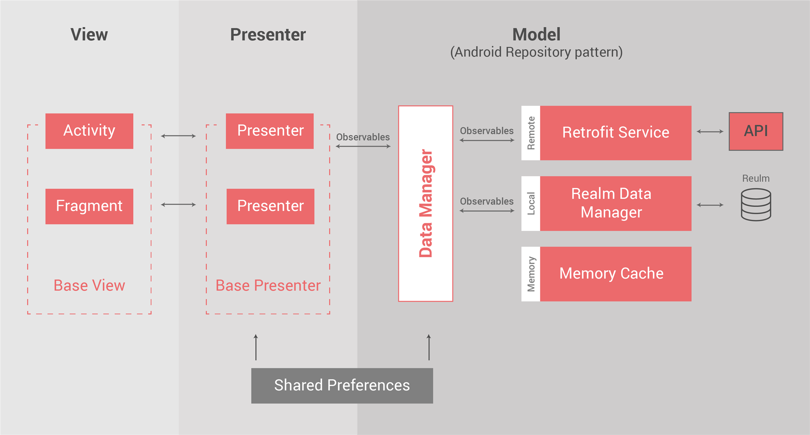

# TAS Android Boilerplate
<p align="center">
  
</p>

Sample Android app that [The App Solutions](https://theappsolutions.com/) company developers used as a reference for new Android projects. It shows the architecture and guidelines of most company's projects and provides base utils that can be used for many common tasks.

## Tech stack

- Android Support libraries
- [RxJava 2](https://github.com/ReactiveX/RxJava) and [RxAndroid](https://github.com/ReactiveX/RxAndroid)
- [Retrofit 2](http://square.github.io/retrofit/) as REST Client
- Dependency Injection with [Dagger 2](http://google.github.io/dagger/)
- [Realm](https://github.com/realm/realm-java) as local database
- [Butterknife](https://github.com/JakeWharton/butterknife)
- [Firebase Analytics](https://firebase.google.com/docs/analytics/android/start/)
- [Fabric Analytics and Crashlytics](https://docs.fabric.io/android/fabric/overview.html)
- [Annimon](https://github.com/aNNiMON/Lightweight-Stream-API) Stream Backport
- [Timber](https://github.com/JakeWharton/timber)
- [Glide](https://github.com/bumptech/glide) for picture processing
- [RxBinding](https://github.com/JakeWharton/RxBinding)
- [Realm Adapter](https://github.com/realm/realm-android-adapters)
- [JAVA Tuples](https://github.com/javatuples/javatuples)
- [AutoValue](https://github.com/google/auto/tree/master/value) with extensions [AutoValueParcel](https://github.com/rharter/auto-value-parcel) and [AutoValueGson](https://github.com/rharter/auto-value-gson)
- [ChangeLog View](https://github.com/gabrielemariotti/changeloglib)
- Functional tests with [Espresso](https://google.github.io/android-testing-support-library/docs/espresso/index.html)
- [Robolectric](http://robolectric.org/)
- [Mockito](http://mockito.org/)
- Memory leak detection with [Leakcanary](https://github.com/square/leakcanary)
- [Stetho](https://github.com/facebook/stetho) debug bridge
- [Checkstyle](http://checkstyle.sourceforge.net/), [PMD](https://pmd.github.io/) and [Findbugs](http://findbugs.sourceforge.net/) for code analysis
- Set of Utils

## Requirements

- JDK 1.8
- [Android SDK](http://developer.android.com/sdk/index.html).
- Android L [(API 21) ](http://developer.android.com/tools/revisions/platforms.html).
- Latest Android SDK Tools and build tools.


## Architecture

This project follows TAS's Android architecture guidelines that are based on [MVP (Model View Presenter)](https://en.wikipedia.org/wiki/Model%E2%80%93view%E2%80%93presenter). For data layer used [Repository Design Pattern](https://www.messenger.com/t/100005362788474) with Reactive ([RxJava](https://github.com/ReactiveX/RxJava)) callbacks. Presenters, Managers and some Utils provided by Dependency Injection ([Dagger 2](http://google.github.io/dagger/))



## Utils

This project contains wide list of different utils that help to solve a lot of common task.

### Data

- **ValidationUtils** - util that provides validation of different fields. Can be used as instance with predefined rules and messages.
- **TimeConvertingUtils**
- **StringUtils** 
- **RoundingHelper** 
- **RandomUtils** 
- **CountryCodeUtils** - utils for country codes processing 
- **OccurrencesIndexFinder** - util for finding start/end indexes of phrase in text

### Storage

- **FileSystemHelper** - utils for working with files
- **RealmImporter** - manger that provides importing Realm database from json
- **RealmUtils** - base Realm operations wrapper

### UI

- **DialogFactory** - provides simple access to base Android workflow dialogs
- **FragmentUtils**
- **ToastUtils**
- **ViewUtils** - Set of static methods with common view operations and calculations

### Other

- **StreamsUtils**
- **RxUtils**
- **OptUtils** - provides sets of methods that help to manipulate with Optional
- **NetworkUtils**
- **LogUtils**
- **IntentUtils**
- **HardwareUtils**
- **BuildInfoUtils**
- **ApiUtils** - set of methods that wrap main transformations and checking while working with REST API
- **GaidRetriever** - provide access to Google Advertising ID
- **PermissionsCheckActivity** - base activity for screens with permission checking
- **PermissionsUtils**

## Code Quality

This project integrates a combination of unit tests, functional test and code analysis tools.

### Tests

To run **unit** tests on your machine:

```
./gradlew test
```

To run **functional** tests on connected devices:

```
./gradlew connectedAndroidTest
```

### Code Analysis tools

The following code analysis tools are set up on this project:

* [PMD](https://pmd.github.io/): It finds common programming flaws like unused variables, empty catch blocks, unnecessary object creation, and so forth. See [this project's PMD ruleset](config/quality/pmd/pmd-ruleset.xml).

```
./gradlew pmd
```

* [Findbugs](http://findbugs.sourceforge.net/): This tool uses static analysis to find bugs in Java code. Unlike PMD, it uses compiled Java bytecode instead of source code.

```
./gradlew findbugs
```

* [Checkstyle](http://checkstyle.sourceforge.net/): It ensures that the code style follows [our Android code guidelines](https://github.com/ribot/android-guidelines/blob/master/project_and_code_guidelines.md#2-code-guidelines). See our [checkstyle config file](config/quality/checkstyle/checkstyle-config.xml).

```
./gradlew checkstyle
```

### The check task

To ensure that your code is valid and stable use check:

```
./gradlew check
```

This will run all the code analysis tools and unit tests in the following order:


## New project setup

To quickly start a new project from this boilerplate follow the next steps:


* Download this repository.
* Change the package name. 
  * Rename packages in main, androidTest and test using Android Studio.
  * In `app/build.gradle` file, `packageName` and `testInstrumentationRunner`.
  * In `src/main/AndroidManifest.xml`.
* Create a new git repository, [see GitHub tutorial](https://help.github.com/articles/adding-an-existing-project-to-github-using-the-command-line/).
* Replace the example code with your app code following the same architecture.
* In `app/build.gradle` add the signing config to enable release versions.
* Add Fabric API key and secret to fabric.properties and uncomment Fabric plugin set up in `app/build.gradle`
* Add `google-services.json` for using Firebase services, [see tutorial](https://developers.google.com/android/guides/google-services-plugin).
* Update `proguard-rules.pro` to keep models and add extra rules to file if needed.
* Update README with information relevant to the new project.
* Update LICENSE to match the requirements of the new project.

## License

```
    Copyright 2018 The App Solutions.

    Licensed under the Apache License, Version 2.0 (the "License");
    you may not use this file except in compliance with the License.
    You may obtain a copy of the License at

       http://www.apache.org/licenses/LICENSE-2.0

    Unless required by applicable law or agreed to in writing, software
    distributed under the License is distributed on an "AS IS" BASIS,
    WITHOUT WARRANTIES OR CONDITIONS OF ANY KIND, either express or implied.
    See the License for the specific language governing permissions and
    limitations under the License.
```
